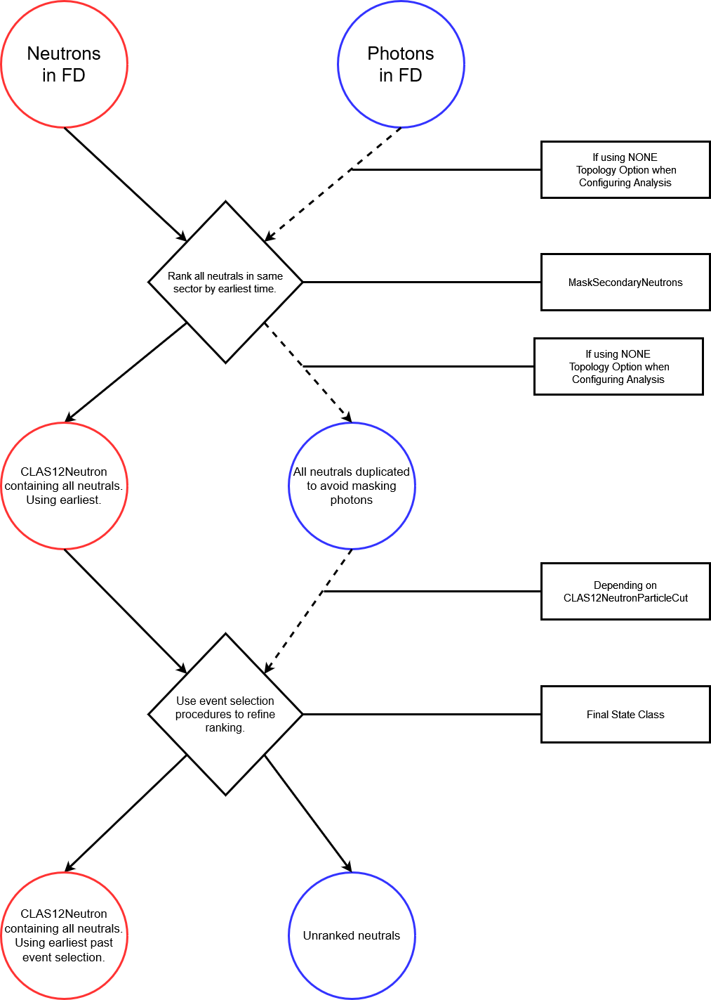

Masking particles
=================

The event builder provides a list of particles that have been reconstructed per
event. However it may be that some of these particle candidates are not good
and analysing them can result in many background events when using a combitorial
algorithm. To address this chanser provides the ability to mask certain
particles from the event, so they are not used in deciding topologies or
assigned to final state particles.

This technique is particularly relevent for neutral particle candidates :
photons and neutrons, due to the likelihood of split off clusters in
calorimeters for example.

To make you own mask class you must inherit from the MaskedEventParticles class.

You may decide to try one of the already existing masks for your analysis.
It would be a good idea to run parallel chanser final state configurations,
one with the mask and one without to see the impact.

The recommended order when using the already existing masks is as follows:

* MaskRadPhotons
* MaskCalorSplitOffs
* MaskSecondaryNeutrons

The reason for this is that the RadPhotons class will use radiative photons to correct the momentum of electrons and positrons, but these photons could be removed by either of the CalorSplitOffs or SecondaryNeutrons masks. The SecondaryNeutrons then introduces a new particle class (as detailed below) which would be unsuited to CalorSplitOffs.

Masking Calorimeter split-off clusters
**************************************

Often when one particle (charged or neutral) hits the calorimeter the clustering
algorithm can generate more than 1 distinct cluster, these additional clusters
are refered to as split-offs here.

They can be identified by their close proximity to another cluster or charged track. Here we use the distance between hits to identify split-offs.

The algorithm follows:

1. Look for all FD neutral hits (photons+neutrons)
2. Remove photon candidates with no PCAL hit
3. Iterate through neutrals and for each 
   a. Loop through all other particles
   b. Calculate angle difference with neutral candidate EC XYZ position and PCAL XYZ for other neutrals and trajectory position on PCAL for charged particles.   
   c. If difference is less than cut value, assume split-off cluster and *remove or from event*, if other particle was a neutral add the 2 neutral clusters together if this option, MergeNeutrals, is requested.

      Diagnostic histograms are saved in the ouput directory with filename MaskCalorSplitOffs.root to let you check cut values.

To use this algorithm you must assign it to your final state class when you are configuring it, i.e. in Create script,

::
        Usage : MaskCalorSplitOffs(AngleDiffNeutral,AngleDiff+ve,AngleDiff-ve,MergeNeutrals)
   
        auto useEBPidFor = "ALL"; //or "NONE"
        auto useInclusiveFilterFor = "ALL"; //or "NONE" or "gamma:neutron" (i.e. as may gammas and neutrons but exact other particles)
	auto FS = dglazier::Pi2::Make(useEBPidFor,useInclusiveFilterFor);
 	...
	...
        FS->MaskParticles(new MaskCalorSplitOffs(30,30,30,1) );

Note this only works when the inclusive option (useInclusiveFilterFor) is set to ALL in your final state constructor.

Angle differences are specified in degrees.

Masking Radiated photons
************************

When an electron or positron are created it an interaction in the target they
may radiate a bremsstrahlung photon and loose some energy. These photons
will be directed along the momentum of the charged particle that emmitted it.
As these photons are often created before the electron enters the toroidal field
we can expect to find these photons in the calorimeters at a postion given
by the reconstructed charge particle momentum direction. These photons can
then be removed from the event and their energy given to the charged particle
parent.

The algorithm proceeds as,

1. Collect all electrons and positrons
2. Collect all neutral calorimeter hits with a PCAL hit as photon candidates
3. Take the photon hit postion from its PCAL position
4. Loop over electrons, take their position from PCAL
5. Calculate momentum theta,phi and position difference between electron and photon
6.  If theta difference is below set value, and position difference is above a set value, then consider this a radiated photon
7. In case particle was identified as neutron, its energy will not be calorimeter energy deposit, so calculate total calorimeter energy deposit and correct from sampling fraction read in from ccdb.
8.  If radiated add photon enegy to electron momentum 4-vector.
9.  Assign the electron a new detector number :....
10. Repeat for positrons.

    
To use this algorithm you must assign it to your final state class when you are configuring it, i.e. in Create script,

::
   
   Usage : 
   MaskRadPhotons(Float_t positionDiffCut,Float_t thetaDiffCut, Short_t addToElectron)
      
   auto useEBPidFor = "ALL"; //or "NONE"
   auto useInclusiveFilterFor = "ALL"; //or "NONE" or "gamma:neutron" (i.e. as may gammas and neutrons but exact other particles)
   auto FS = dglazier::Pi2::Make(useEBPidFor,useInclusiveFilterFor);
   ...
   ...
   FS->MaskParticles(new MaskRadPhotons(10,0.5,1));
   
Note this only works when the inclusive option (useInclusiveFilterFor) is set to ALL in your final state constructor.

Angle differences are specified in degrees.

Diagnostic histograms are saved in the ouput directory with filename .root to let you check cut values.

Masking Secondary Neutron Clusters
**********************************

At the bottom with title “Masking Secondary Neutrons:”

When neutrons interact with a detector they can create secondary particles which will be assigned a neutral ID if they produce a hit in the calorimeters. These secondary neutrals can be due to either real physical processes, for example pi0 production when the neutrons interact with material in the detector (could be the calorimeters or the FTOF), or these can be due to issues in the reconstruction algorithm which creates two clusters when there should only be a single cluster. However, the original neutron hit generally occurs at an earlier time than the hits in the calorimeter associated with these secondaries, whether they occur in the same or subsequent calorimeter layers.

The masking algorithm then proceeds as:

1. Decide whether to apply the masking to all neutrals or only neutrals identified as neutrons by the event builder PID. This is dependent on the topology PID option (ALL or NONE) specified when configuring your analysis.
2. Collect all neutrals (with or without event builder PID) with a hit in the Forward Detector.
3. Record the time of each neutral in the layer closest to target (eg taken first from PCAL, then ECIN, then ECOUT when a hit exists in each of these), separated into corresponding sectors.  
4. Loop over each sector, identify the earliest neutral by sorting by lowest value of time.
5. Convert the earliest neutral CLAS12Particle to CLAS12Neutron and assign this as the main candidate. If the option _maskSecondaries is set to false, collate all other neutrals into a vector assigned to the CLAS12Neutron particle.

IMPORTANT
---------

   When using the NONE topology option, each neutral will be duplicated, existing both within the list of candidates contained by the CLAS12Neutron and as a separate particle. This is so that different logic can be applied to both photons and neutron while still masking secondaries. In this case you’ll need to add a particle cut when configuring your analysis:

::
   
     auto useEBPidFor = "NONE"; //or "ALL"
     auto useInclusiveFilterFor = "ALL";
     auto FS = username::FSWithNeutron::Make(useEBPidFor,useInclusiveFilterFor);
     FS->MaskParticles(new MaskSecondaryNeutrons(1));
     ...
     ...
     ParticleCutsManager c12N("C12Neutrons",1); //1=> will be applied
     c12N.AddParticleCut("neutron",new CLAS12NeutronParticleCut(true));
     c12N.AddParticleCut("gamma",new CLAS12NeutronParticleCut(false));
     FS->RegisterPreTopoAction(c12N);

Note first of all that the cut class takes a bool as argument, this states if we want neutrons or photons to be valid CLAS12Neutrons. This should be set to false for photons and true for neutrons, and the neutrons will then appear as one CLAS12Neutron whereas photons will be individual particles. Secondly, it’s important to register this as a PreTopo action as you might want to refine the selection process as detailed below. If using usePID="ALL" option you do not need this additional step as the mask will only be applied to neutrons as IDed by the Event Builder.

An example of the code required in your _doToTopo function follows,

::

      bool goodNeutron=false;
      for(int ineut = 0; ineut<_n.Candidates();ineut++){
         _n.UseCandidate(ineut);

         //calculate missing 4-vector
         auto miss = _beam + _target - _el.P4() - _po.P4() - _n.P4();
 
         //check if this was the earliest neutron to pass cut
         if(abs(miss.M2())<1 ){
            goodNeutron=true; //can now use this
 	    break;	 //it was! we will use this one
         }//missing mass cut
      }//loop over candidate neutrons

      if(goodNeutron==false) return RejectEvent();

Due to the introduction of CLAS12Neutron particles, a few other alterations are needed to your final state code. First, you’ll need to declare your neutron particle as a CLAS12Neutron in your FS.h file instead of CLAS12Particle.

Secondly, you’ll need to account for the fact that the CLAS12Neutron contains many candidates and therefore any cuts or corrections applied pre-topo will need to loop over all candidates. An example of this is given in the actions/FDn_PathCorrections class.

Note standard cuts may not always work for this as they will only be applied to the lead neutron.

Below is a schematic of the overall process, where the circles denote particles, lozenges represent actions applied to the particles, and the rectangles denote the class applying the action. The lines denote the flow of particles through the algorithm as these are ranked, with the dashed lines indicating that photons might not be acted upon here if the ALL topology option was used.

